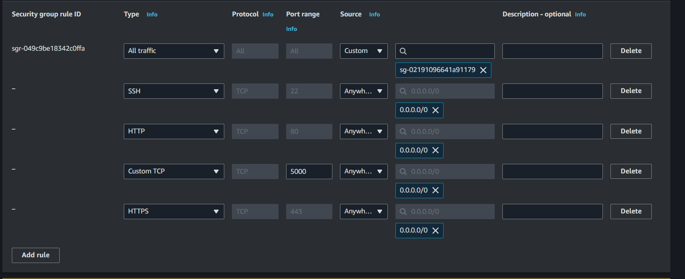
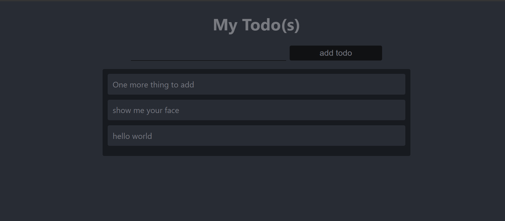

# Deploying a Web Solution using MERN STACKS ON EC2

## Introduction

The MERN stack consists of MongoDB, Express, React / Redux, and Node.js. The MERN stack is one of the most popular JavaScript stacks for building modern single-page web applications.

**This guide demonstrates how to build a todo application that uses a RESTful API on an Ubuntu 20.04 server using EC2**

## Step 0

1. EC2 Instance of t2.micro type and Ubuntu 24.04 LTS (HVM) was lunched in the us-east-1 region using the AWS console


<br><br>
<br><br>

_Ensure you use **t3.small** for the instance type_

2. The security group was configured with the following inbound rules:

- Allow traffic on port 80 (HTTP) with source from anywhere on the internet.
- Allow traffic on port 443 (HTTPS) with source from anywhere on the internet.
- Allow traffic on port 22 (SSH) with source from any IP address. This is opened by default.
- Allow traffic on port 5000 with source from any IP address.
<br><br>

3. Let's Connect our instance using SSH, then `cd` into the folder where the `private-key` was downloaded then ssh into it

<br><br>

```bash
$ cd desktop

$ chmod 400 steghub.pem

ssh -i "mern.pem" ubuntu@ec2-34-227-7-216.compute-1.amazonaws.com
```

<br>


## Step 1 - Setup Node Server

1. Update and upgrade list of packages in package manager

```bash
sudo apt update
sudo apt upgrade -y
```

<br><br>

2. Locate the Node.js software from [Ubuntu repositories](https://github.com/nodesource/distributions#deb).

```bash
curl -fsSL https://deb.nodesource.com/setup_18.x | sudo -E bash -
```

<br><br>

3. Install Node.js on the server

```bash
sudo apt-get install -y nodejs
```

<br><br>

_The above command installs both nodejs and npm(node modules)_

4. Verify the node and the npm version

```bash
node -v
npm -v
```

<br><br>


## Application Code Setup

1. Create a new directory for the To-Do task and list all the file in the directory. 

```bash
$ mkdir Todo

$ ls -a
```

<br><br>

1. Change directory to the `Todo` directory

```bash
cd Todo
```

2. Initialise the project 

```bash
npm init
```
___NB: A new file package.json will be created. Follow the prompts after running the command___


## Install ExpressJs

1. To use Express, install it using npm

```bash
npm install express
```
<br><br>

2. Install dotenv module

```bash
npm install dotenv
```

<br><br>

3. Create a file index.js and type the following code into it and save:

```bash
nano index.js
```


```bash
const express = require('express');

const app = express();

const port = process.env.PORT || 5000;

app.use((req, res, next) => {
  res.header('Access-Control-Allow-Origin', '*');
  res.header('Access-Control-Allow-Headers', 'Origin, X-Requested-With, Content-Type, Accept');
  next();
});

app.use((req, res, next) => {
  res.send('Welcome to Express');
});

app.listen(port, () => {
  console.log(`Server running on port ${port}`);
});
```
__NB: use `ctrl + x`  and then `y` to save then press `enter` to exit_

<br><br>

4. Start the server to see if it works. 

```bash
node index.js
```

<br><br>

__NB: Ensure you have opened the port `5000` in your security group_

5. Open up your browser and try to access your server's Public IP followed by port `5000`

```bash
curl icanhazip.com #get public IP
```

http://PublicIP:5000


<br><br>

## Step 2 - Creating the Routes

There are three things that the app needs to do:

- create a task
- view all tasks
- delete a completed task

For each task, you will need to create routes that will define multiple endpoints that the todo app will depend on.(POST, GET, DELETE).

1. Create a folder `routes`.

```bash
$ mkdir routes && cd routes

```

2. Create a file `api.js` and open the file then write the code below.

```bash
$ touch api.js

nano api.js
```

```bash
const express = require('express');
const router = express.Router();

router.get('/todos', (req, res, next) => {
  // get placeholder
});

router.post('/todos', (req, res, next) => {
  // post placeholder
});

router.delete('/todos/:id', (req, res, next) => {
  // delete placeholder
});

module.exports = router;
```

<br><br>

<br><br>

## Step 3 - Define the Models

This app makes use of MongoDB, we need to create a model and a schema. <br>Models are defined using the schema interface. <br> The schema is a blueprint of how the database will be constructed. 

To create a schema and a model, install Mongoose which is a Node package that makes working with MongoDB easier.

1. Install `mongoose`

```bash 
npm install mongoose
```
<br><br>


2. Create a new folder in your root directory and name it `models`. Inside it create a file and name it `todo.js` with the following code in it:

```bash
$ mkdir models && cd models && touch todo.js
```

3. Edit the `todo.js`

```bash 
nano todo.js
```
And Paste:
```bash
const mongoose = require('mongoose');
const Schema = mongoose.Schema;

// Create schema for todo
const TodoSchema = new Schema({
  action: {
    type: String,
    required: [true, 'The todo text field is required'],
  },
});

// Create model for todo
const Todo = mongoose.model('todo', TodoSchema);

module.exports = Todo;
```


<br><br>

4. Now, we need to update our routes in `api.js` to make use of the new model.

In the Routes directory, Open `api.js`

```bash 
nano api.js
```

Paste this in `routes/api.js`:

```bash
const express = require('express');
const router = express.Router();
const Todo = require('../models/todo');

router.get('/todos', (req, res, next) => {
  // This will return all the data, exposing only the id and action field to the client
  Todo.find({}, 'action')
    .then((data) => res.json(data))
    .catch(next);
});

router.post('/todos', (req, res, next) => {
  if (req.body.action) {
    Todo.create(req.body)
      .then((data) => res.json(data))
      .catch(next);
  } else {
    res.json({
      error: 'The input field is empty',
    });
  }
});

router.delete('/todos/:id', (req, res, next) => {
  Todo.findOneAndDelete({ _id: req.params.id })
    .then((data) => res.json(data))
    .catch(next);
});

module.exports = router;
```

## Step 4 - Connecting to a Database

1. [Sign Up](https://www.mongodb.com/products/try-free/platform/atlas-signup-from-mlab)  to mongoDB

2. Create a cluster, select AWS as the cloud provider and choose a region near you. 

<br><br>

Then your Cluster is created.
<br><br>

3. Create a user and give it admin access. Click on `database Access` on the left sidebar.

Then your Cluster is created.
<br><br>

4. Click on `Browse collection`, to create a database.

<br><br>

5. Click `Connect` to connect your Database with a Driver. Select `mongoose` and copy the `Connection strings` 
<br><br>

6. Create a file in the `Todo` directory and name it `.env`

```bash
$ touch .env
```

Open the file with nano editor

```bash
nano .env

# Paste your database connection string in it 
Db = mongodb://<USER>:<PASSWORD>@example.mlab.com:port/todo
```


Make sure you use your own MongoDB URL from mLab after you created your database and user. Replace `<USER>` with the username and `<PASSWORD>` with the password of the user you created.


<br><br>

7. Update `index.js` to reflect the use of `.env` so that Node.js can connect to the DB. 

```bash
nano index.js
```

Paste this:

```bash
const express = require('express');
const bodyParser = require('body-parser');
const mongoose = require('mongoose');
const routes = require('./routes/api');
const path = require('path');

require('dotenv').config();

const app = express();

const port = process.env.PORT || 5000;

// Connect to the database
mongoose
  .connect(process.env.Db, { useNewUrlParser: true })
  .then(() => console.log(`Database connected successfully`))
  .catch((err) => console.log(err));

// Since mongoose's Promise is deprecated, we override it with Node's Promise
mongoose.Promise = global.Promise;

app.use((req, res, next) => {
  res.header('Access-Control-Allow-Origin', '*');
  res.header('Access-Control-Allow-Headers', 'Origin, X-Requested-With, Content-Type, Accept');
  next();
});

app.use(bodyParser.json());

app.use('/api', routes);

app.use((err, req, res, next) => {
  console.log(err);
  next();
});

app.listen(port, () => {
  console.log(`Server running on port ${port}`);
});
```

<br><br>

8. Start Nodejs Server

```bash
node index.js
```
<br><br>

Now, open your browser and navigate to http://[publicIP]:5000/api/todos.


## Step 5 - Test Backend Code using RESTful API

You'll need to install [Postman](https://www.getpostman.com) or you can use VScode Extension called ThunderClient. 

1. Create a POST method  and navigate to `http://publicIP:5000/api/todos.` and type this in the `body`

```bash 
POST publicIP:5000/api/todos/
```

```bash
{
    "action": "Victor working with DevOps engineer"
}
```

<br><br>
<br><br>


2. To list all the POST request, we run the GET method

```bash 
GET publicIP:5000/api/todos/
```

<br><br>


3. To Delete a specific POST require, we run this on the DELETE method

```bash 
Delete publicIP:5000/api/todos/<id>
```

<br><br>

## STEP 6 - Create the FrontEnd

it is time to create an interface for the client to interact with the API. To start out with the frontend of the todo app, you will use the `create-react-app` command to scaffold your app.
In the same `todo` directory

1. Run this command

```bash
npx create-react-app client
```

2. Install concurrently 
Concurrently is used to run more than one command simultaneously from the same terminal window. 

```bash 
npm install concurrently --save-dev
```

3. Install nodemon 
Nodemon is used to run the server and monitor it as well. If there is any change in the server code, Nodemon will restart it automatically with the new changes.

```bash 
npm install nodemon --save-dev
```

3. Configure nodemon in the package.json in the `Todo `directory

```bash
nano package.json
```

Paste this in the Scripts block:

```bash 
{
  // ...
  "scripts": {
    "start": "node index.js",
    "start-watch": "nodemon index.js",
    "dev": "concurrently \"npm run start-watch\" \"cd client && npm start\""
  },
  // ...
}
```

<br><br>

4. Configure Proxy in package.json located in the `Client` directory.

```bash 
$ cd client
nano package.json
```

then add

```bash 
{
  // ...
  "proxy": "http://localhost:5000"
}
```

<br><br>

5. Run `npm run dev` and make sure you are in the todo directory and not in the client directory.

```bash
npm run dev
```

<br><br>

_Your app will be open and running on PublicIP:3000_

_Enusre you open port 3000 in your AWS Security group_

<br><br>


## Step 7 — Creating the React Components

For your todo app, there will be two state components and one stateless component.

1. Inside your `src` folder create another folder called  `components` and inside it create three files `Input.js`, `ListTodo.js`, and `Todo.js`.

```bash 
$ cd client && cd src && mkdir components && cd components

$ touch Input.js ListTodo.js Todo.js
```

2. Open Input.js
```bash
nano Input.js
```

Paste this:

```bash
import React, { Component } from 'react';
import axios from 'axios';

class Input extends Component {
  state = {
    action: '',
  };

  addTodo = () => {
    const task = { action: this.state.action };

    if (task.action && task.action.length > 0) {
      axios
        .post('/api/todos', task)
        .then((res) => {
          if (res.data) {
            this.props.getTodos();
            this.setState({ action: '' });
          }
        })
        .catch((err) => console.log(err));
    } else {
      console.log('input field required');
    }
  };

  handleChange = (e) => {
    this.setState({
      action: e.target.value,
    });
  };

  render() {
    let { action } = this.state;
    return (
      <div>
        <input type="text" onChange={this.handleChange} value={action} />
        <button onClick={this.addTodo}>add todo</button>
      </div>
    );
  }
}

export default Input;
```
<br><br>

_To make use of axios, which is a Promise-based HTTP client for the browser and Node.js, you will need to navigate to your client directory from your terminal:_

```bash
$ cd client
```

Then run 

```bash 
npm install axios
```

<br><br>

3. Go back to the component directory

```bash 
$ cd src/components
```

4. Open `ListTodo.js` with nano text editor 

```bash
nano ListTodo.js
```

and Paste this:

```bash
import React from 'react';

const ListTodo = ({ todos, deleteTodo }) => {
  return (
    <ul>
      {todos && todos.length > 0 ? (
        todos.map((todo) => {
          return (
            <li key={todo._id} onClick={() => deleteTodo(todo._id)}>
              {todo.action}
            </li>
          );
        })
      ) : (
        <li>No todo(s) left</li>
      )}
    </ul>
  );
};

export default ListTodo;
```

<br><br>

5. Open `Todo.js` with nano text editor 

```bash
nano Todo.js
```

and Paste this:

```bash 
import React, { Component } from 'react';
import axios from 'axios';
import Input from './Input';
import ListTodo from './ListTodo';

class Todo extends Component {
  state = {
    todos: [],
  };

  componentDidMount() {
    this.getTodos();
  }

  getTodos = () => {
    axios
      .get('/api/todos')
      .then((res) => {
        if (res.data) {
          this.setState({
            todos: res.data,
          });
        }
      })
      .catch((err) => console.log(err));
  };

  deleteTodo = (id) => {
    axios
      .delete(`/api/todos/${id}`)
      .then((res) => {
        if (res.data) {
          this.getTodos();
        }
      })
      .catch((err) => console.log(err));
  };

  render() {
    let { todos } = this.state;

    return (
      <div>
        <h1>My Todo(s)</h1>
        <Input getTodos={this.getTodos} />
        <ListTodo todos={todos} deleteTodo={this.deleteTodo} />
      </div>
    );
  }
}

export default Todo;
```
<br><br>


6. Adjust the React code by Deleting the logo and adjust `App.js` to look like this:

```bash
$ cd ..
```

Open App.js with nano text editor

```
nano App.js
```
Paste this:

```bash

import React from 'react';
import Todo from './components/Todo';
import './App.css';

const App = () => {
  return (
    <div className="App">
      <Todo />
    </div>
  );
};

export default App;

```

7. In the src directory, open the  `App.css`
```bash
nano App.css
```

then paste this:

```bash
.App {
  text-align: center;
  font-size: calc(10px + 2vmin);
  width: 60%;
  margin-left: auto;
  margin-right: auto;
}

input {
  height: 40px;
  width: 50%;
  border: none;
  border-bottom: 2px #101113 solid;
  background: none;
  font-size: 1.5rem;
  color: #787a80;
}

input:focus {
  outline: none;
}

button {
  width: 25%;
  height: 45px;
  border: none;
  margin-left: 10px;
  font-size: 25px;
  background: #101113;
  border-radius: 5px;
  color: #787a80;
  cursor: pointer;
}

button:focus {
  outline: none;
}

ul {
  list-style: none;
  text-align: left;
  padding: 15px;
  background: #171a1f;
  border-radius: 5px;
}

li {
  padding: 15px;
  font-size: 1.5rem;
  margin-bottom: 15px;
  background: #282c34;
  border-radius: 5px;
  overflow-wrap: break-word;
  cursor: pointer;
}

@media only screen and (min-width: 300px) {
  .App {
    width: 80%;
  }

  input {
    width: 100%
  }

  button {
    width: 100%;
    margin-top: 15px;
    margin-left: 0;
  }
}

@media only screen and (min-width: 640px) {
  .App {
    width: 60%;
  }

  input {
    width: 50%;
  }

  button {
    width: 30%;
    margin-left: 10px;
    margin-top: 0;
  }
}
```


8. In the src directory, open the  `index.css`


```bash
nano index.css
```

Paste this:

```bash
body {
  margin: 0;
  padding: 0;
  font-family: -apple-system, BlinkMacSystemFont, "Segoe UI", "Roboto", "Oxygen", "Ubuntu", "Cantarell", "Fira Sans", "Droid Sans", "Helvetica Neue", sans-serif;
  -webkit-font-smoothing: antialiased;
  -moz-osx-font-smoothing: grayscale;
  box-sizing: border-box;
  background-color: #282c34;
  color: #787a80;
}

code {
  font-family: source-code-pro, Menlo, Monaco, Consolas, "Courier New", monospace;
}
```


9. Go back to the `Todo` directory 
```bash
$ cd  ../..
```

10. On the Todo directory run

```bash
npm run dev
```


11. Open in the browser http//publicIP:3000




## Conclusion
We just created a todo app using the MERN stack. A frontend application using React that communicates with a backend application written using Express.js. Created a MongoDB backend for storing tasks in a database.
