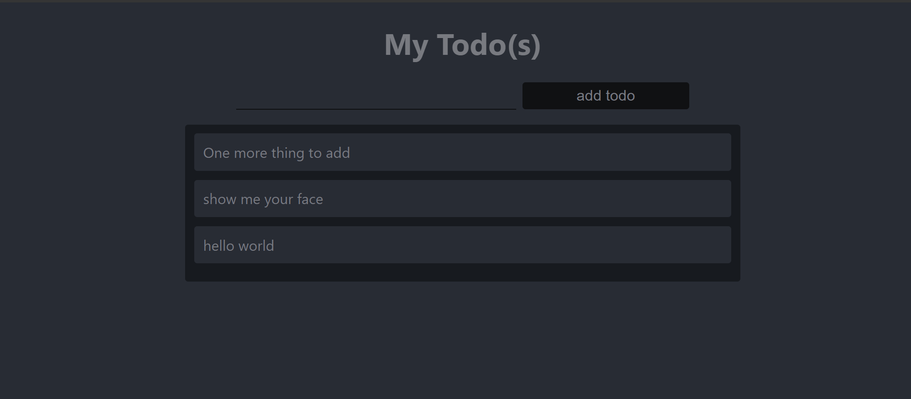

# Deploying TODO using MERN STACKS

The MERN stack consists of MongoDB, Express, React / Redux, and Node.js. The MERN stack is one of the most popular JavaScript stacks for building modern single-page web applications.

Build a todo application that uses a RESTful API

**This guide demonstrates how to install a MERN stack on an Ubuntu 20.04 server using EC2**

## Prerequisites

- AWS Account 
- Launch EC2 with Ubuntu
- MongoDB atlas Account

## Setup a MERN Stack on Ubuntu
- Install npm
- install express
- Install Node 
- Input react
- Install axios

